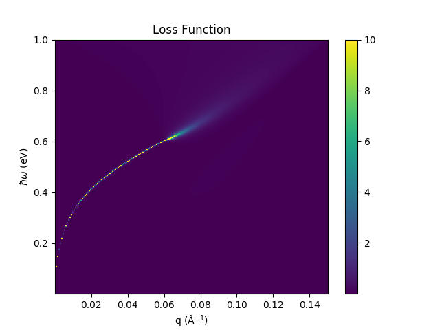
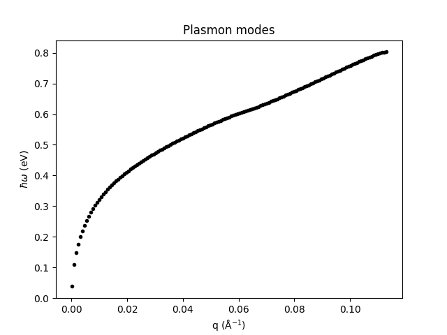

.. _gettingstarted:

=================
 Getting started
=================

The QEH python package implements a simple command line
interface (CLI) to make QEH calculations without writing python
scripts. This is very useful when investigating standard properties of
heterostructures. However, QEH calculations can also be performed in
Python scripts which is useful if the CLI is not sufficient. This
tutorial first introduces the QEH CLI and ends with a description of
writing Python scripts that call the QEH code.

Command line interface
======================
To see the help for the CLI do

.. command-output:: qeh -h
   :ellipsis: 10

There are many options for the CLI but most important is the
``layers`` argument which describes the layers that make up the
heterostructure. For example to build a heterostructure consisting of
doped graphene on 3 layers of boron nitride do::

  $ qeh graphene+doping=0.5 3BN

For example the plasmons of a doped graphene on three layers of boron
nitride can be calculated and saved as::

  $ qeh graphene+doping=0.5 3BN --plasmons --save-plots "_g-3BN"

which creates a figure ``loss_g-3BN.png`` containing the loss spectrum
and a figure ``plasmon_modes_g-3BN.png`` which traces the plasmon
modes:

	

Here we introduced a couple of key concepts. You can modify layers
with the ``+`` syntax. For example, the example above used the layer
modifier ``doping=0.5`` which doped graphene. See the doping_ section
for details about this modifier. Because boron nitride is polar there
will be an additional contribution to the dielectric properties from
its phonons. These have been calculated as well and can be included
with the phonons_ modifier

Available monolayers
====================
To find a list of the monolayers that are available for the QEH
model::

  $ qeh --list

In this list you can see if any default layer thickness is available,
if there exists a phonon building block and whether any effective
masses exist to be used for the doping modifier. By default, the
effective electron mass is used for doped semiconductors.

Default thicknesses
===================
The default thicknesses of a monolayer is derived from its
corresponding bulk phase in ICSD if it exists. Use ``$ qeh --list`` to
show the default thickness of a monolayer.

Doped semiconductors and graphene
=================================
.. _doping:

The doping modifier can be used to dope graphene or a semi-conducting
monolayer. The doping modifier takes additional arguments which can be
providided using a comma separated list::

  $ qeh H-MoS2+doping=0.1,T=25e-3,eta=1e-3,em=0.43

Here we dope MoS2 in the H phase with at a finite temperature
of 25 meV (``T=25e-3``), a relaxation rate of 3 meV (``eta=1e-3``) and
with an effective mass of 0.43 electron masses ``em=0.43``.

If no default mass is specified, QEH will use default parameters
obtained from [#C2DB]_ . Use ``$ qeh --list`` to show the default
effective masses (marked with ``(d)``). 

.. [#C2DB] http://c2db.fysik.dtu.dk

Phonons and isotopes
====================
.. _phonons:

For some polar semi conductors the QEH code implements the lattice
polarization response due to polar optical phonons. To see whether
this is a available for a given monolayer use ``$ qeh --list`` and
look for ``+phonons available`` which means that the phonon modifier
is available. The phonon modifier can be used as::

  $ qeh 10BN+phonons

which could construct a heterostructure of 10 BN layers including the
lattice response.

.. note::
   
   Note that if the phonon modifier is not present::

     $ qeh 10BN
     
   then the calculated results will only inlude the electronic
   response.

When calculating the lattice response it is possible to manually
specify the isotopic mass of the atoms that constitute the
monolayer. Similar to supplying arguments for the doping modifier if
we can to specify the isotopic mass of boron in BN we can do::

  $ qeh 5BN+phonons,m_B=10 5BN+phonons,m_B=11

which creates a heterostructure consisting of 5 B :sup:`10` N
monolayers on 5 B :sup:`11` N monolayers.
